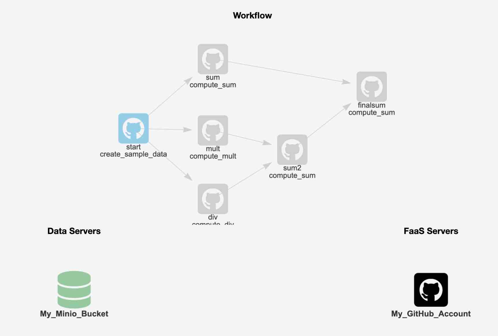

# Introduction

FaaSr is a package that makes it easy for developers to create R functions and workflows that can run in the cloud, on-demand, based on triggers - such as timers, or repository commits. It is built for Function-as-a-Service (FaaS) cloud computing, and supports both widely-used commercial (GitHub Actions, AWS Lambda, IBM Cloud) and open-source platforms (OpenWhisk). It is also built for cloud storage, and supports the S3 standard also widely used in commercial (AWS S3), open-source (Minio) and research platforms (Open Storage Network). With FaaSr, you can focus on developing the R functions, and leave dealing with the idiosyncrasies of different FaaS platforms and their APIs to the FaaSr package.

# Objectives

This tutorial guides you through the setup and execution of a simple FaaSr workflow. In this tutorial, you will learn how to describe, configure, and execute a FaaSr workflow of R functions in the cloud, using GitHub Actions for cloud execution of functions, and a public Minio S3 “bucket” for cloud data storage. With the knowledge gained from this tutorial, you will be able to also run FaaSr workflows in OpenWhisk and Amazon Lambda, as well as use an S3-compliant bucket of your choice. 

# Requirements

For a reproducible experience, this tutorial is designed to work with either a Posit Cloud instance (in the cloud), or the [rocker/rstudio Docker container](https://rocker-project.org/) (on your own computer). You can also run this tutorial from your existing RStudio environment - you will need to install devtools, sodium, minioclient, and credentials packages for FaaSr.

The main requirements to run the tutorial is a GitHub account. More specifically, you need: 
1) a GitHub account, 
2) a GitHub personal access token (PAT), and,  
3) Either a [Posit cloud account](https://posit.cloud/) (which you can login with GitHub), or [Docker installed in your computer](https://docs.docker.com/get-started/) (You can also use your own Rstudio; however, the Posit cloud and Rocker approaches are recommended for reproducibility),
4) a Minio S3 bucket (you can use the [Play Console](https://min.io/docs/minio/linux/administration/minio-console.html#minio-console) to use a public/unauthenticated server)

* You can explore the Console using https://play.min.io:9443. Log in with the following credentials:
```
Username: Q3AM3UQ867SPQQA43P2F
Password: zuf+tfteSlswRu7BJ86wekitnifILbZam1KYY3TG
```

While you can use your existing GitHub PAT if you have one, it is recommended that you create a short-lived GitHub PAT token for this tutorial if you plan to use Posit Cloud. [Detailed instructions to create a PAT are available here](https://docs.github.com/en/authentication/keeping-your-account-and-data-secure/managing-your-personal-access-tokens#creating-a-personal-access-token-classic); in summary:

* In the upper-right corner of any page, click your profile photo, then click Settings.
* In the left sidebar, click Developer settings.
* In the left sidebar, click Personal access tokens (Classic).
* Click Generate new token (Classic); *note: make sure to select Classic*
* In the "Note" field, give your token a descriptive name.
* In scopes, select “workflow” and “read:org” (under admin:org). 
* Copy and paste the token; you will need to save it to a file in your computer for use in the tutorial


# Start your Rstudio session on Posit Cloud, or local Docker

## For Posit Cloud

[Login with your GitHub account](https://posit.cloud/login), and then [navigate to your Posit workspace](https://posit.cloud/content/yours?sort=name_asc). Click on New Project, and select "New RStudio Project". This will start RStudio and connect you to it through your browser.

## For local Docker

"Pull" and run the Rocker RStudio container with the following command in your terminal (note: set your own password by replacing "yourpassword"):

```
docker pull rocker/rstudio
docker run --rm -ti -e ROOT=true -e PASSWORD=yourpassword -p 8787:8787 rocker/rstudio
```

*Note for Mac M1/2/3 users: currently the Arm64 version of the Rocker container fails to install devtools; the commands below download and run an amd64-based Rocker that works with this tutorial:*

```
docker pull --platform linux/amd64 rocker/rstudio
docker run --rm -ti --platform linux/amd64 -e ROOT=true -e PASSWORD=yourpassword -p 8787:8787 rocker/rstudio
```

Then, point your browser to http://localhost:8787 and log in (username is rstudio and use the password you provided in the command above)


*Note: don't forget to terminate your Posit Cloud session (click on the "Trash" next to your workspace) or your Docker container (ctrl-C on the terminal) at the end of the tutorial*

# Install FaaSr package and required dependences

## Clone the FaaSr tutorial repo

First let's clone the FaaSr tutorial repo - copy and paste this command in the terminal:

```
system('git clone https://github.com/FaaSr/FaaSr-tutorial')
```

Click on FaaSr-Tutorial folder on the lower right window (Files), then

Select More > Set as Working Directory from the drop down menu.

## Source the script that sets up FaaSr and dependences

Run one of the following commands, depending on your setup (Posit, or local Docker). Fair warning: it will take a few minutes to install all dependences:

### For Posit Cloud:

```
source('posit_setup_script')
```

### For local Docker

```
source('rocker_setup_script')
```

### For Rstudio desktop

If you are using Rstudio natively in your desktop, without Docker (*note: you may need to install the sodium library separately for your system*):

```
source('rstudio_setup_script')
```

# Configure Rstudio to use GitHub Token

Within Rstudio, configure the environment to use your GitHub account (replace with your username and email). Input this into the console:

```
usethis::use_git_config(user.name = "YOUR_GITHUB_USERNAME", user.email = "YOUR_GITHUB_EMAIL")
```

Now set your GitHub token as a credential for use with Rstudio - paste your token to the pop-up window that opens with this command pasted into the console:

```
credentials::set_github_pat()
```

# Configure the FaaSr secrets file with your GitHub token

Open the file named faasr_env in the editor. You need to enter your GitHub token here: replace the string "REPLACE_WITH_YOUR_GITHUB_TOKEN" with your GitHub token, and save this file. 

The secrets file stores all credentials you use for FaaSr. You will notice that this file has the pre-populated credentials (secret key, access key) to access the Minio "play" bucket.

# Configure the FaaSr JSON simple workflow template with your GitHub username

Open the file tutorial_simple.json and replace the string "YOUR_GITHUB_USERNAME" with your GitHub username, and save this file.

The JSON file stores the configuration for your workflow. We'll come back to that later.

# Register and invoke the simple workflow with GitHub Actions

Now you're ready for some Action! The steps below will:

* Use the faasr function in the FaaSr library to load the tutorial_simple.json and faasr_env in a list called faasr_tutorial
* Use the register_workflow() function to create a repository called FaaSr-tutorial in GitHub, and configure the workflow there using GitHub Actions
* Use the invoke_workflow() function to invoke the execution of your workflow

Enter the following commands to your console:

```
faasr_tutorial <- faasr(json_path="tutorial_simple.json", env="faasr_env")
faasr_tutorial$register_workflow()
```

When prompted, select "public" to create a public repository. Now run the workflow:

```
faasr_tutorial$invoke_workflow()
```

# Browse the S3 Data Store to view outputs

Now the workflow is running; soon it will create outputs in the Minio play S3 bucket. You can track the progress of the actions in your GitHub Actions page. You can use the mc_ls command to browse the outputs in the console:

```
mc_ls("play/faasr/tutorial")
mc_cat("play/faasr/tutorial/sample1.csv")
mc_cat("play/faasr/tutorial/sample2.csv")
mc_cat("play/faasr/tutorial/sum.csv")
```

The simple example you just executed consists of two R functions: create_sample_data.R creates two CSV files, and compute_sum.R computes their sum.  You will eventually see three files that have been produced by the execution of the tutorial workflow: sample1.csv and sample2.csv (created by the function create_sample_data) and sum.csv (created by the function compute_sum)

# Add a timer trigger

In the example above, you triggered the tutorial workflow once (manually) with the invoke_workflow() function. You can also set a timer trigger for your workflow with set_workflow_timer(cron), where cron is a string in the cron format. For example, you can set a timer for every 10 minutes:

```
faasr_tutorial$set_workflow_timer("*/10 * * * *")
```

Check your Actions tab in your FaaSr-tutorial repo, wait for the next 10-minute interval (note that GitHub does not guarantee a precise start time "on the dot"), and you will see that the workflow now will get invoked multiple times.

Make sure you unset the timer once you're done testing this feature:

```
faasr_tutorial$unset_workflow_timer()
```


# A more complex workflow

The tutorial includes a more complex workflow, as shown in the diagram below:



To run this workflow, you can follow similar steps as above, but you will be working with a different JSON file - one that describes the larger workflow.

**First off, you need to open the file tutorial_larger.json and replace the string "YOUR_GITHUB_USERNAME" with your GitHub username, and save this file**

Then, you can load this file into another R list faasr_tutorial_larger:

```
faasr_tutorial_larger <- faasr(json_path="tutorial_larger.json", env="faasr_env")
```

Use it to create a new repository for this workflow with GitHub Actions (remember to type public when prompted):

```
faasr_tutorial_larger$register_workflow()
```

Then invoke the workflow:

```
faasr_tutorial_larger$invoke_workflow()
```

You can monitor the outputs in the S3 bucket using minioclient:

```
mc_ls("play/faasr/tutorial2")
```

# Using the FaaSr workflow builder

While you can create and edit FaaSr configuration files in any text editor, FaaSr also provides a Shiny app graphical user interface to facilitate the development of simple workflows using your browser. You can use it to edit a configuration from scratch, or from an existing JSON configuration file that you upload as a starting point, and then download the edited JSON file to your computer for use in FaaSr, for example as in faasr_tutorial_larger <- faasr(json_path="tutorial_larger.json", env="faasr_env")

[Right-click here to open the FaaSr workflow builder in another window](https://faasr.shinyapps.io/faasr-json-builder/). To test it, you can upload the tutorial_larger.json from this tutorial, and you will be able to visualize and edit the workflow shown above.

# Test local execution

While FaaSr is designed to allow you to execute workflows and access data in the cloud, in an automated and unmanaged way, it is useful to test workflow executions locally so you can verify desired functionality and debug errors. FaaSr provides a function that allows you to run a workflow locally in your desktop. 

First you need to create, in your working directory, a folder named `faasr_data` (if it doesn't already exist). 
This folder mimics the behavior of an S3 bucket, but locally in your computer.
Inside this folder, you store the payload and credentials file (`tutorial_simple.json` and `faasr_env` in the example below), and you need to create another folder named `R`. You then need to copy your R functions to this folder:

```
system("mkdir -p faasr_data/R")
system("cp *.R faasr_data/R")
system("cp tutorial_simple.json faasr_data")
system("cp faasr_env faasr_data")
```

You also may need to install arrow, if it's not yet installed in your system:

```
install.packages("arrow")
arrow::install_arrow(minimal = FALSE)
```

Now you can run the workflow locally using `$faasr_test`:

```
faasr_tutorial$faasr_test()
```

The outputs are available within the `faasr_data` folder. Again, this folder behaves as if it were an S3 bucket, but local to your computer.

# Managing log files

FaaSr generates log files for each worflow execution that are stored in the S3 bucket. 
By default, these logs are stored in a folder FaaSrLog, and each workflow log is stored in a folder with a name that is a [unique UUID](https://en.wikipedia.org/wiki/Universally_unique_identifier). You can use the following functions to help manage your logs:

```
faasr_tutorial$get_log_df()
```
Queries for all logs in your S3 bucket and writes a data frame with this information to file named `faasr_output_logs.txt` in your current working directory.

```
faasr_tutorial$get_log(UUID)
```
Downloads the logs from the S3 bucket for a particular UUID (which you can determine by inspecting `faasr_output_logs.txt`)

```
faasr_tutorial$delete_log(UUID)
```
Deletes a specific log from the S3 bucket given its UUID

```
faasr_tutorial$delete_log_date(date)
```
Deletes all logs for a particular date from the S3 bucket


# Under the hood - GitHub Actions

This tutorial creates two repositories in your GitHub account:

* FaaSr-tutorial
* FaaSr-tutorial2

Notice that if you browse to these repositories on GitHub, if you select "Actions" on the top tab, you will see a list of actions that have executed (e.g. create_sample_data, sum). 

This repository only holds the actions that were created automatically with the register_workflow FaaSr call, and invoked with invoke_workflow. Feel free to delete these repositories after you finish the tutorial.

# Under the hood - S3 buckets

Note that, in this tutorial, for a quick start, a bucket called faasr is created 
automatically for you (in Minio Play) as part of the setup script, with the
minioclient mc_mb command, as follows:

```
install.packages('minioclient')
library('minioclient')
install_mc()
mc_mb('play/faasr')
```


In general, you will need to secure an S3
bucket to use with FaaSr. This is covered elsewhere in other documentation.

# (Optional) Using OpenWhisk and AWS Lambda

If you have access to OpenWhisk and/or AWS Lambda accounts, the configuration files tutorial_simple_ow.json tutorial_simple_lambda.json provide templates that you can use to run the same tutorial workflow on these different platforms. 

Here, the R code and the workflow don't change - only the configuration of the ComputeServers in the .json files (and associated credentials in the faasr_env file) are different.
